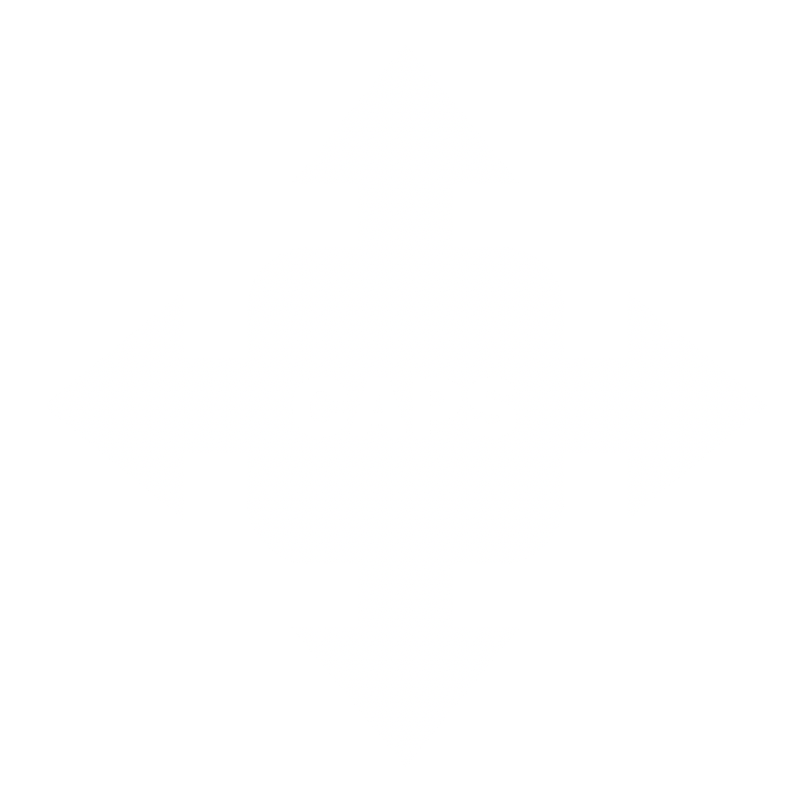

# capsnav

[](https://github.com/muu0726/capsnav/actions/workflows/release.yml)
[](LICENSE)

<p align="center">
  
</p>

**capsnav** は、CapsLockキー本来の機能を完全無効化した上で、「CapsLock + I/J/K/L」を直感的な矢印キー操作に変換する、Windows および macOS 向けの常駐型システムトレイ / メニューバーツールです。

WindowsタスクトレイおよびmacOSメニューバーにアイコンとして常駐し、GUIから簡単に動作状態の確認、有効/無効の切り替え、および終了操作が可能です。

---

## 主な特徴

- 🚫 **CapsLockの完全無効化**: CapsLock単体押し・長押しを問わず、OS標準の大文字トグル（およびキーボードLED点灯）をシステムレベルで遮断します。
- 🧭 **IJKL ナビゲーション（ホールド判定）**: CapsLockを物理的に押している間（ホールド中）のみ、`I` / `J` / `K` / `L` を矢印キーに高速変換。キーを離すと即座に通常のキー入力に戻ります。
- ⚡ **修飾キー完全連携（パススルー）**: `Shift + CapsLock + I` によるテキスト範囲選択や、`Ctrl` / `Cmd` / `Alt` / `Option` と組み合わせた単語単位ジャンプ等のショートカットがそのまま動作します。
- 🖥️ **システムトレイ / メニューバー常駐**:
  - Windows: タスクバー右下の通知領域（システムトレイ）に常駐。黒いコンソール画面は一切表示されません。
  - macOS: 画面上部メニューバーに常駐（Dockアイコンを出さないAccessoryモード。Template Image対応）。
- 🔘 **GUIトレイメニュー（日本語UI）**:
  - `capsnav (稼働中 / 一時停止)`: 現在の動作状態を表示。
  - `有効` / `一時停止`: チェックボックスによる機能のON/OFF切り替え。
  - `ログイン時に起動`: OS起動時の自動起動登録トグル。
  - `capsnav を終了`: バックグラウンドフックを解除して安全に終了。
- 🪶 **単一スタンドアロンバイナリ**: モノクロ透過アプリアイコン画像はビルド時にバイナリ内へ直接埋め込まれているため、外部ファイル不要で単体動作します。

---

## キー対応表

| キー入力 | 変換後の動作 | 説明 |
| :--- | :--- | :--- |
| **`CapsLock` (ホールド)** | *(無効化 / 破棄)* | 大文字固定トグルやLED点灯は発生しません |
| **`CapsLock押下 + I`** | **`↑` (Up Arrow)** | 上へ移動 |
| **`CapsLock押下 + J`** | **`←` (Left Arrow)** | 左へ移動 |
| **`CapsLock押下 + K`** | **`↓` (Down Arrow)** | 下へ移動 |
| **`CapsLock押下 + L`** | **`→` (Right Arrow)** | 右へ移動 |
| **`Shift + CapsLock押下 + I/J/K/L`** | **`Shift + ↑ / ← / ↓ / →`** | テキスト等の範囲選択 |
| **`Ctrl / Cmd + CapsLock押下 + J/L`** | **`Ctrl / Cmd + ← / →`** | 単語単位のカーソルジャンプ |

> [!NOTE]
> CapsLockを押下しながら `I/J/K/L` 以外のキー（例: `A` や `Space`）を入力した場合は、通常の入力としてそのまま通過します。CapsLockキーを離すと即座に通常のキー入力に戻ります。

---

## トレイメニューの操作方法

Windowsではタスクバー右下の通知領域アイコン、macOSでは上部メニューバーのアイコンをクリック（または右クリック）するとメニューが表示されます。

```text
┌───────────────────────────┐
│  capsnav (稼働中)         │  <- 動作状態（クリック不可）
├───────────────────────────┤
│  ✔ 有効                   │  <- 機能の有効/一時停止トグル
│  ✔ ログイン時に起動       │  <- ログイン時自動起動の登録/解除
├───────────────────────────┤
│  capsnav を終了           │  <- プロセスの安全な終了
└───────────────────────────┘
```

- **「有効」のチェックを外した場合**: 一時停止状態（メニュー表記も「一時停止」に変化）となり、CapsLockおよびIJKLが通常のキーとして機能します。再度チェックを入れると即座にナビゲーションが再開されます。
- **「ログイン時に起動」**: チェックを入れると、OS起動（ログイン）時に `capsnav` が自動起動するように登録されます（Windows: レジストリ、macOS: LaunchAgents）。チェックを外すと自動起動の登録が解除されます。

---

## インストール & 初回実行手順

### 1. GitHub Releases からダウンロード

[GitHub Releases](https://github.com/muu0726/capsnav/releases) より、最新バイナリをダウンロードしてください。

- **Windows**: `capsnav-windows-x86_64.exe`
- **macOS**: `capsnav-macos-universal`（Apple Silicon / Intel 両対応のUniversal Binary）

---

### 2. Windows での手順

1. ダウンロードした `capsnav-windows-x86_64.exe` を任意の固定フォルダ（例: `C:\Tools\capsnav\` など）に配置します。
2. ダブルクリックして実行すると、タスクバー右下の通知領域にアイコンが表示されます。
3. トレイメニューの **「Launch at Startup」** にチェックを入れると、次回以降のPC起動時に自動で常駐します。

#### ⚠️ Windows Defender / SmartScreen 警告が出た場合
未署名の個人開発バイナリであるため、初回実行時に「WindowsによってPCが保護されました」という青い警告画面が表示される場合があります:
1. 警告画面内の **「詳細情報」** をクリックします。
2. 右下に現れる **「実行」** ボタンをクリックします。

---

### 3. macOS での手順

1. ターミナルを開き、ダウンロードしたバイナリに実行権限を付与します:
   ```bash
   chmod +x capsnav-macos-universal
   ```

2. 実行します:
   ```bash
   ./capsnav-macos-universal
   ```

#### 🛡️ macOS アクセシビリティ許可の自動誘導
キーボードイベントの低レベルフック（`CGEventTap`）にはアクセシビリティ権限が必要です。
`capsnav` は起動時に権限がないことを検知すると、ダイアログ表示とともに**自動的に「システム設定 > プライバシーとセキュリティ > アクセシビリティ」を開きます**。
> 「capsnav の実行にはアクセシビリティ権限が必要です。『システム設定 > プライバシーとセキュリティ > アクセシビリティ』で capsnav を許可してください。」

1. 開いた設定画面のリスト内で **「capsnav」**（または実行中のターミナル）のトグルを **オン** にします。
2. 許可後、再度実行してください。

#### ⚠️ macOS Gatekeeper 警告（「開発元を検証できないため開けません」）が出た場合
1. Finderで `capsnav-macos-universal` を表示します。
2. `Control` キーを押しながらバイナリをクリックし、**「開く」** を選択します。
3. 確認ダイアログで **「開く」** をクリックします。

---

## アイコンデザインについて

本ツールのアイコンは、macOS のメニューバー（Template Image によるライト/ダーク自動反転対応）や Windows のシステムトレイに美しく調和するよう、白黒・モノクロ（グレースケール透過）デザインを採用しています。
中央のキーキャップシンボルから上下左右の4方向へシャープな矢印が広がる視認性の高いベクター調デザインとなっており、`assets/icon.png` としてプロジェクト内に格納され、ビルド時に `include_bytes!` マクロによってバイナリ内に直接埋め込まれているため、ランタイムで追加のアセットファイルを読み込む必要がありません。

---

## ソースコードからのビルド

```bash
# クローン
git clone https://github.com/muu0726/capsnav.git
cd capsnav

# デバッグ実行 (コンソールログ表示あり)
cargo run

# リリースビルド (WindowsではコンソールなしのGUIモード)
cargo build --release
```

macOS Universal Binary のビルド:
```bash
rustup target add aarch64-apple-darwin x86_64-apple-darwin
cargo build --release --target aarch64-apple-darwin
cargo build --release --target x86_64-apple-darwin

lipo -create -output capsnav-macos-universal \
  target/aarch64-apple-darwin/release/capsnav \
  target/x86_64-apple-darwin/release/capsnav
```

---

## ライセンス

本プロジェクトは [MIT License](LICENSE) の下で公開されています。
